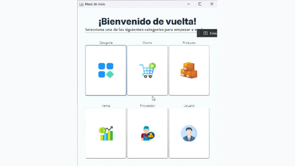
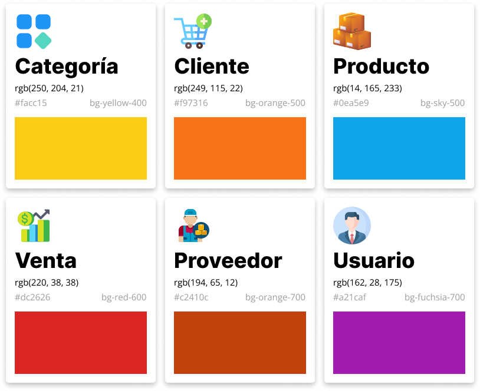
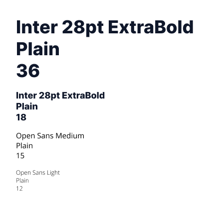
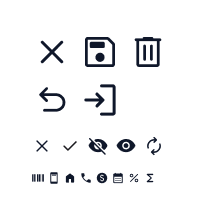

# Sistema de Ventas

Este proyecto consiste en un Sistema Gestor de Base de Datos para una empresa hipotética que debe registrar las ventas que realizan sus clientes, y así también los proveedores, productos, categorías y otras entidades involucradas en la transacción.

La realización del proyecto fue dirigida por Edgar Trejo Avila, bajo la mentoría de la profesora Luz María Feregrino Martínez, profesora de la clase de Bases de Datos para Aplicaciones de la Universidad Tecnológica de San Juan del Río, en el periodo comprendido entre mayo y agosto del 2024.

## Tecnologías Utilizadas

- **NetBeans** como IDE para la programación de la app en Java
- **MySQL** como base de datos local para el proyecto
- **Figma** como plataforma de diseño para la UI

## Características

- Sistema de inicio de sesión \
  El proceso para registrar usuarios no fue automatizado (es decir, los nuevos usuarios deben codificarse manualmente en la base de datos), pero una vez dentro del sistema, pueden acceder a la información de la app usando su nombre y contraseña

- Soporte para registrar las siguientes entidades:
  - Categoría
  - Cliente
  - Producto
  - Venta
  - Proveedor
  - Usuario

- Validación de datos en el formulario de registro \
  Utilizando clases personalizadas en el directorio `/util/input-verifier/` es que se logra verificar la entrada del usuario antes de registrarla en la base de datos local

- Actualización automática de stock al realizar una venta \
  Por supuesto, cuando se realiza una venta, la cantidad en stock del producto vendido se decrementa según la cantidad seleccionada por el usuario

- Componentes personalizados de Java Swing \
  Se desarrolló una pequeña librería de componentes en Java Swing para lograr el atractivo visual de la aplicación; los componentes se encuentran distribuidos en diferentes directorios de la aplicación como `typography/`, `controller/`, `card/`, etc.

## Hoja de Diseño 

### Entidades

### Tipografía

### Íconos

## Demostración de Uso

El video en `readme-assets/usage-demonstration.mp4` muestra cuál es el uso esperado para la aplicación

